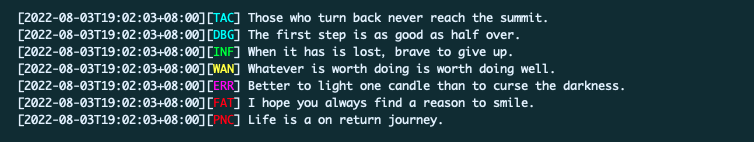

# ZKits Logger Library #

[](https://github.com/edoger/zkits-logger)
[](https://github.com/avelino/awesome-go)
[](https://github.com/edoger/zkits-logger/actions/workflows/ci.yml)
[](https://ci.appveyor.com/project/edoger56924/zkits-logger/branch/master)
[](https://coveralls.io/github/edoger/zkits-logger?branch=master)
[](https://www.codacy.com/manual/edoger/zkits-logger?utm_source=github.com&amp;utm_medium=referral&amp;utm_content=edoger/zkits-logger&amp;utm_campaign=Badge_Grade)
[](https://goreportcard.com/report/github.com/edoger/zkits-logger)

## About ##

This is a zero-dependency standard JSON log library that supports structured JSON logs and is compatible with the standard library.

 - Does not depend on any third-party libraries.
 - Provides controllable caller and stack information reporting.
 - Provides 7 log level support.
 - Compatible with standard library logger *log.Logger.
 - Support chain calls and add multiple log extension data.
 - Provides logging hook support.
 - Built-in multiple log formatters, support custom log formatters.
 - Support log output to different writers by level.
 - Supports output interceptor to easily hijack and control log output.
 - Provides a log file writer that supports log file rotation by size.

According to the plan, this library will release 2 versions every year. 
If there are new security issues or PRs, we will release new versions according to the actual situation.



> Example image uses the ConsoleFormatter and disables the exit and panic functions.
> For the default Logger instance, we use the JSONFormatter.

## Install ##

```sh
   go get -u -v github.com/edoger/zkits-logger
```

## Quick Start ##

```go
    import "github.com/edoger/zkits-logger"

    // Creates a logger instance with the specified name.
    // Empty name are allowed.
    log := logger.New("app")
    // {"level":"info","message":"Hello.","name":"app","time":"2020-02-20T20:20:20+08:00"}
    log.Info("Hello.")
    // {"fields":{"field":1},"level":"info","message":"Hello.","name":"app","time":"2020-02-20T20:20:20+08:00"}
    log.WithField("field", 1).Info("Hello.")
```

## Design Concept ##

### Zero Dependencies ###

We think the logger should be lightweight enough, because the applications we develop are already complex 
enough, they often have massive third-party dependencies, so let's not add additional dependencies to the 
application, which is why I built this library one of the reasons.

### No Locker ###

For the performance of the logger, we adopt a lock-free design as a whole.
Therefore, we agree that the shared data of the logger is read-only, and we require the application 
to not modify its internal shared data after initializing the logger. (formatters, log writers, hooks, etc).

> For the logger level, it can be modified at runtime, as it is a common and meaningful operation 
> for applications to adjust the level of the logger at runtime.

We recommend initializing the logger (Logger) as soon as it is created (if required by the application), 
using the logging interface ``` Logger.AsLog() ``` to provide logging functionality.

```go
    package log
    
    import "github.com/edoger/zkits-logger"
    
    var defaultLogger = logger.New("name")

    // Initialize the logger.
    func Initialize(/* Your config */) {
        // defaultLogger.SetLevel(Level)
        // defaultLogger.SetOutput(Writer)
        // defaultLogger.SetFormatter(Formatter)
        // ... ...
    }

    // GetLogger gets the default logger instance.
    func GetLogger() logger.Log {
        // Mask the setting method of Logger.
        return defaultLogger.AsLog()
    }
```

### Chained Calls & Log Tree ###

Chained calls are more in line with the way we think when writing source code (left-to-right, continuous).
We have designed a number of ``` Log.With* ``` methods to extend the additional fields of the log, 
and through these methods, more field information can be recorded. 
At the same time, these methods will create and return new log objects, 
we can use this feature to add differentiated fields to different modules.

```go
    // Create Log instance with additional properties.
    // All SubLog inherit the properties of the BaseLog (properties with the same name will be overwritten), 
    // and they are independent of each other and no longer associated with the BaseLog.
    SubLog1 := BaseLog.WithField("key", value)
    SubLog2 := BaseLog.WithFields(map[string]interface{}{/* multiple fields */})
    SubLog3 := BaseLog.WithContext(ctx)
    /* More ... */

    // Add a logger for the submodule, the logs recorded by the submodule all have
    // the additional properties we added.
    SubModule.WithLogger(Log.WithField("module", "ModuleName"))
```

Best practices:

```go
    // Good
    Log.WithFields(map[string]interface{}{"field1": var1, "field2": var2})
    // Bad
    Log.WithField("field1", var1).WithField("field2", var2)
```

The application is not a modular design? No additional properties?

```go
    // Add a fixed prefix to log messages.
    log := Log.WithMessagePrefix("Prefix: ")

    log.Info("Step 1 is done!") // Log message: "Prefix: Step 1 is done!"
    log.Info("Step 2 is done!") // Log message: "Prefix: Step 2 is done!"
```

### Quickly Locate Bugs ###

The purpose of the log is to observe the running status of our application. 
When there is a problem with the application, the log can help us quickly find and solve the root cause of the problem.
We've designed our logger with this in mind, and for this reason we provide a very flexible and concise "scenario" grabbing capability.

**Log error:**

```go
    // Tell us the file name and line number when logging the error.
    Log.WithCaller().WithError(err).Error("Task failed!") // Log errors into separate field.
    Log.WithCaller().Errorf("Task failed: %s.", err)

    // Too troublesome? Code too verbose? Then we set it globally!
    // Callers are now automatically added to all logs that meet the level.
    Logger.EnableLevelCaller(ErrorLevel)
    Logger.EnableLevelsCaller([]Level{ErrorLevel, FatalLevel, PanicLevel})
```

**Panic:**

```go
    // Tell us the crash call stack information.
    Log.WithStack().Error("Application crash!")

    // Setting Logger.SetExitFunc(nil) disables the automatic call os.Exit. 
    Log.WithStack().Fatal("Application crash!")
    // Setting Logger.SetPanicFunc(nil) disables the automatic call panic. 
    Log.WithStack().Panic("Application crash!")
```

## Future Overview ##

### Log Hooks ###

Log hooks allow us to do some extra things before logging.
Log hooks are designed to uniformly handle log events (by Level) that we are interested in.
Log hooks should be lightweight enough, such as: counting the number of logs, triggering alarms, etc.

```go
    // Define the hook for our application.
    type AppHook struct {}

    func (*AppHook) Levels() []Level {
        return []Level{ErrorLevel, FatalLevel, PanicLevel}
    }

    func (*AppHook) Fire(s Summary) error {
        // Do something!
        return nil
    }

    // Register application log hook.
    Logger.AddHook(new(AppHook))
```

Don't want to define hook struct?

```go
    Logger.AddHookFunc([]Level{ErrorLevel}, func(s Summary) error {
        // Do something!
        return nil
    })
```

Do we have multiple hooks that need to be registered?

```go
    // Create a hook collection.
    bag := NewHookBag()

    // Add our hooks.
    bag.Add(Hook1)
    bag.Add(Hook2)
    /* ... More ... */
    bag.Add(HookN)

    // Register them all at once.
    Logger.AddHook(bag)
```

> HookBag also needs to adhere to our "No Locker" philosophy, do not continue to add hooks after registration.

### Log Formatter ###

The log formatter is used to format the log object into string data as expected.
The log formatter should be as efficient as possible, this is the most CPU-intensive component of the logger.

We have built in several common formatters, they may not be the best and most suitable, 
but they are rigorously tested and work out of the box.

**JSON Formatter**

```go
    // The default formatter, if you don't change it, that's it.
    f := DefaultJSONFormatter()

    // Create one and configure custom field names.
    // If the full parameter is true, it will always ensure that all fields exist in the top-level json object.
    f, err := NewJSONFormatter(keys map[string]string, full bool)
    f := MustNewJSONFormatter(keys map[string]string, full bool)
```

> Custom JSON field names will not benefit from the optimizations of the JSON serializer.

**Text Formatter**

```go
    f := DefaultTextFormatter()
    f := DefaultQuoteTextFormatter() // Escape invisible characters.

    // The format parameter is used to control the format of the log, and it has many control parameters.
    // For example:
    //     "[{name}][{time}][{level}] {caller} {message} {fields}"
    // The supported placeholders are:
    //     {name}      The name of the logger that recorded this log.
    //     {time}      Record the time of this log.
    //     {level}     The level of this log.
    //     {caller}    The name and line number of the file where this log was generated. (If enabled)
    //     {message}   The message of this log.
    //     {fields}    The extended fields of this log. (if it exists)
    //     {stack}     The call stack of this log. (if it exists)
    // It is worth knowing:
    //     1. For the {time} parameter, we can specify time format, like this: {time@2006-01-02 15:04:05}.
    //     2. For the {level} parameter, we can specify level format, like this: {level@sc},
    //        {level@sc} or {level@cs} will call the Level.ShortCapitalString method.
    //        {level@s} will call the Level.ShortString method.
    //        {level@c} will call the Level.CapitalString method.
    //        For other will call the Level.String method.
    //     3. Considering the aesthetics of the format, for {caller} and {fields} and {stack}, if
    //        there is non-empty data, a space will be automatically added in front.
    //        If this behavior is not needed, use {caller@?} or {fields@?} or {stack@?} parameters.
    // The quote parameter is used to escape invisible characters in the log.
    f, err := NewTextFormatter(format string, quote bool)
    f := MustNewTextFormatter(format string, quote bool)
```

**Console Formatter**

```go
    // The console formatter is very similar to the text formatter. The only difference is that
    // we output different console colors for different log levels, which is very useful when
    // outputting logs from the console.
    f := NewConsoleFormatter()
```

### Output Interceptor ###

The output interceptor can bypass the output writer of the logger binding 
(``` Logger.SetOutput ``` or ``` Logger.SetLevelOutput ``` or ``` Logger.SetLevelsOutput ```) 
and output the log to our custom system (these systems are often dynamic or cannot be wrapped 
as ``` io.Writer ```).

```go
    // The io.Writer in the interceptor parameter is the io.Writer instance bound by the logger.
    Logger.SetOutputInterceptor(func(s Summary, w io.Writer) (int, error) {
        // Do something!
        return s.Size(), nil
    })
```

> Once the output interceptor is enabled, we will no longer write logs to the log writer,
> even if the interceptor returns an error.

### Log Context & Trace ###

The log context is to support the trace technology. 
By default, we will not do any operations on the context object bound to the log. 
If you need to use the link tracking technology, you should define a custom log formatter to 
process the trace data.

```go
    // Bind the context for the log.
    Log.WithContext(ctx)

    // Register a formatter that supports parsing trace data.
    Logger.SetFormatter(FormatterFunc(func(e Entity, b *bytes.Buffer) error {
        ctx := e.Context()
        // 1. Parse trace data from Context.
        // 2. Formats the log Entity and writes the data to the Buffer.
        return nil
    }))
```

> Parsing trace data is difficult to standardize, and solutions used by different applications 
> are completely different, so we leave this function to users to implement.

> ⚠️ The custom log formatter needs to append a newline after the formatted log data is 
> written into the buffer, otherwise the log will not wrap automatically.

### Log Bridge ###

Log bridge is a concept here. Applications often have many third-party libraries and components. 
In order to adapt to the log loggers of these libraries and components, we built some log bridges 
without introducing dependencies. They are responsible for converting our loggers to loggers for 
these libraries and components.

**Standard Library Logger**

```go
    import log // Standard log package

    // Convert our logger to the standard library logger instance.
    g := Logger.AsStandardLogger() // Return *log.Logger instance.

    // You can also customize the default log level.
    log.New(NewLevelWriter(DebugLevel, Logger.AsLog()))
```

> 💣 The *log.Logger automatically exits the system and panics when logging fatal and panic level log.

## License ##

[Apache-2.0](http://www.apache.org/licenses/LICENSE-2.0)
